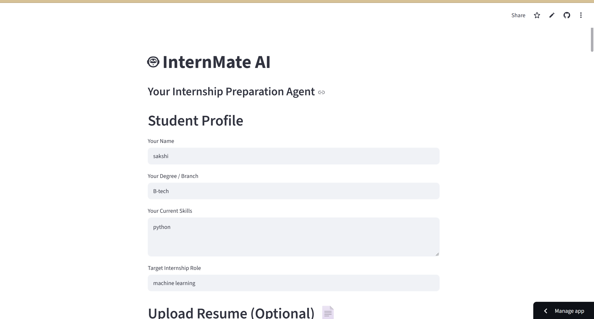
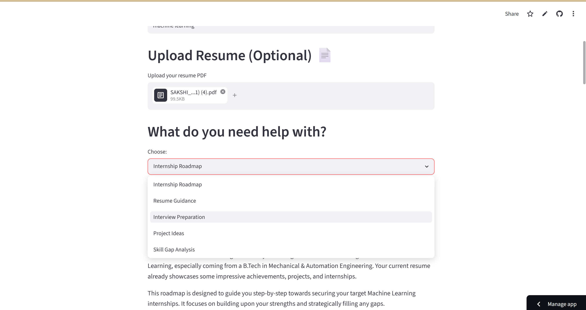
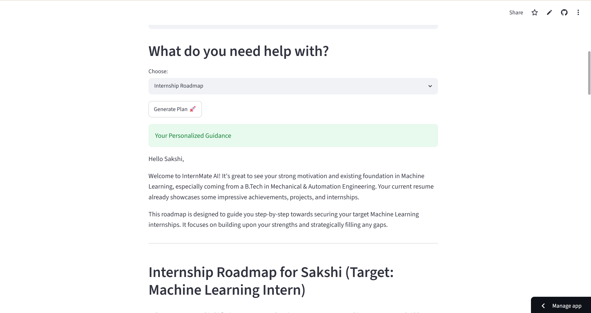

# InternMate AI 🤖

## Internship Preparation Agent

InternMate AI is an AI-powered assistant that helps students prepare for internships using Google Gemini.

## Features

- Resume Guidance
- Skill Gap Analysis
- Internship Roadmaps
- Interview Preparation
- Project Ideas
- Resume PDF Analysis

## Tech Stack

- Python
- Streamlit
- Google Gemini API
- PyPDF

## How to Run

Install dependencies:

pip install -r requirements.txt

Run:

streamlit run app.py

## Project Goal

To provide personalized internship preparation guidance for students.

## 🚀 Live Demo
[Click here to try InternMate AI](https://internmate-ai-byethpdtmcrvdf5ctr4fro.streamlit.app/)

## 📸 Screenshots

### Home Page

### Upload Resume

### Roadmap Output
